# Montagem e desmontagem de computadores

Tutorial prático sobre o processo de desmontagem e montagem de um computador, realizado durante aulas práticas.

## Ferramentas necessárias

Para realizar a desmontagem e montagem do computador, foram utilizadas as seguintes ferramentas:

- Chave Phillips
- Pincel para limpeza
- Pinça

---

## Desmontando o PC Desktop

Lembre-se de deixar a bancada de manutenção limpa e arrumada!

1. Desligue o computador e desconecte todos os cabos e periféricos, como mouse, teclado, monitor, impressora etc.

2. Remova os parafusos que prendem a tampa do gabinete.

3. Desconectar os conectores da fonte de alimentação.

4. Retirar fonte de alimentação do gabinete.

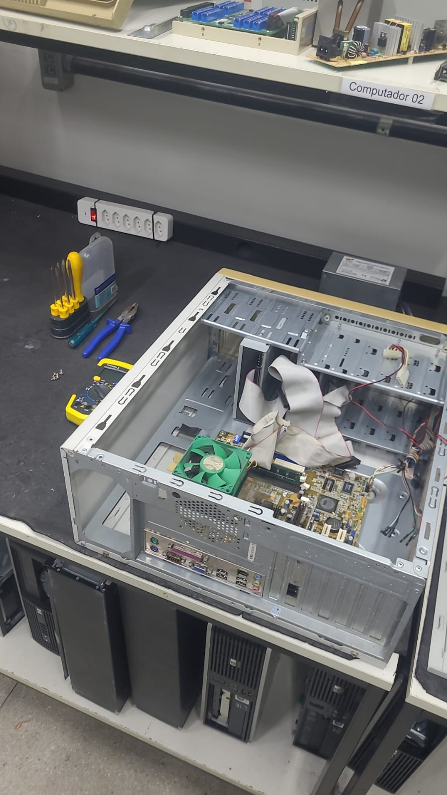

5. Desinstalar placas de vídeo e de som off-board, se houver.

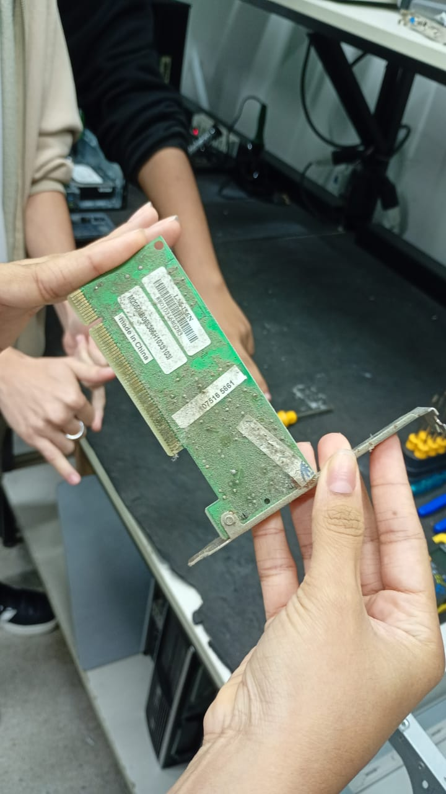

6. Desinstalar outras placas conectadas à placa-mãe, se houver.

7. Desconectar conectores do gabinete acoplados à placa-mãe (somente gabinetes ATX e ITX).

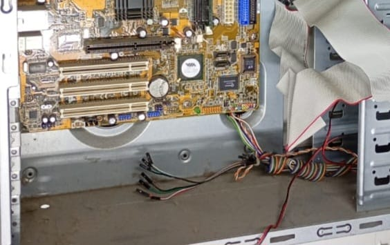

8. Desconectar cabos de dados.

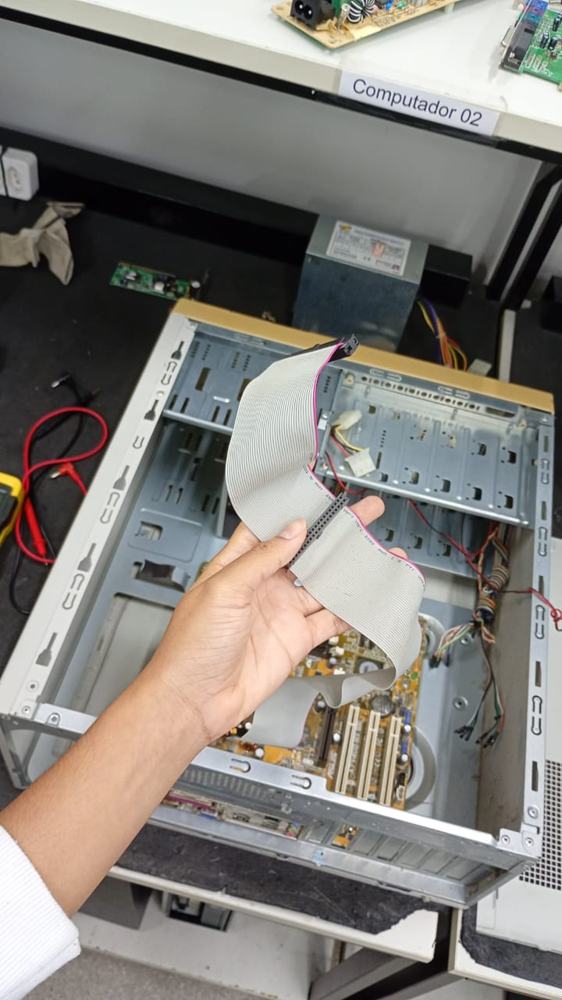

9. Desafixar unidades de armazenamento secundário (HDDs, SSDs, dispositivos ópticos etc.)

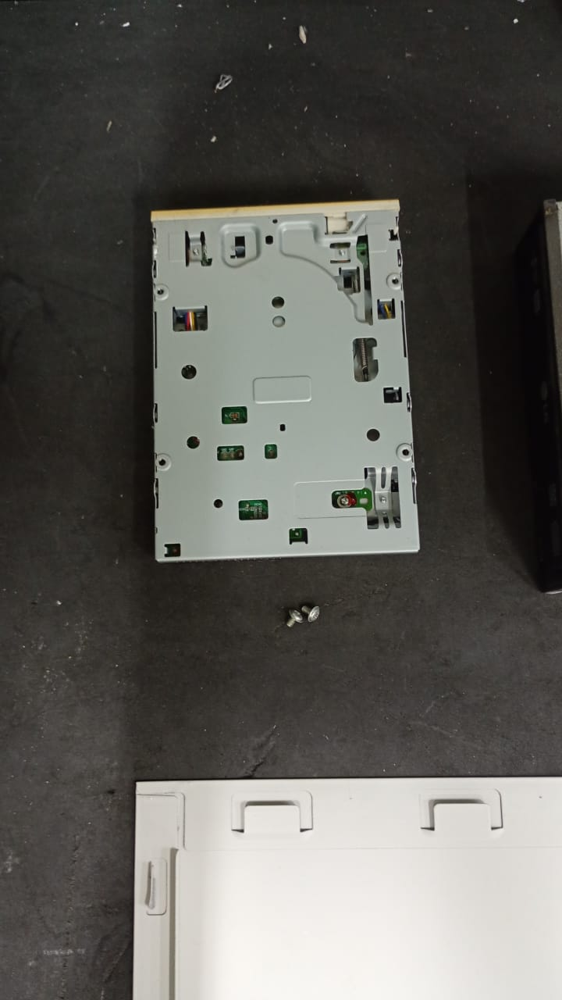

10. Desinstalar memória RAM na placa-mãe.

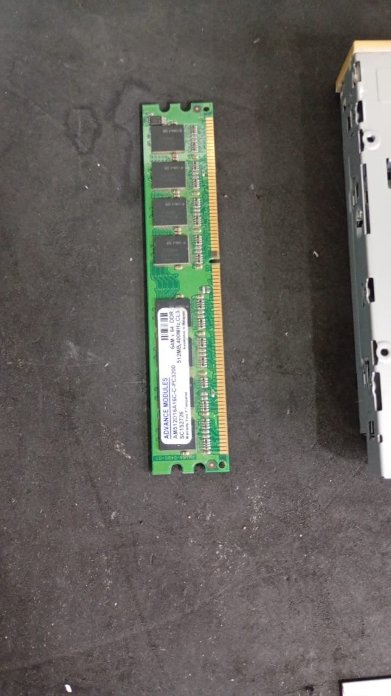

11. Desinstalar dissipador de calor e ventoinha dos processador.

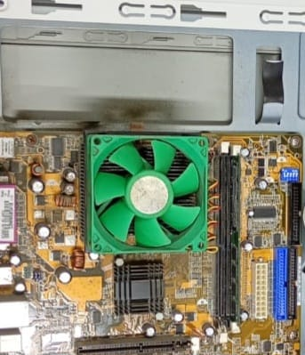

12. Desinstalar processador na placa-mãe.

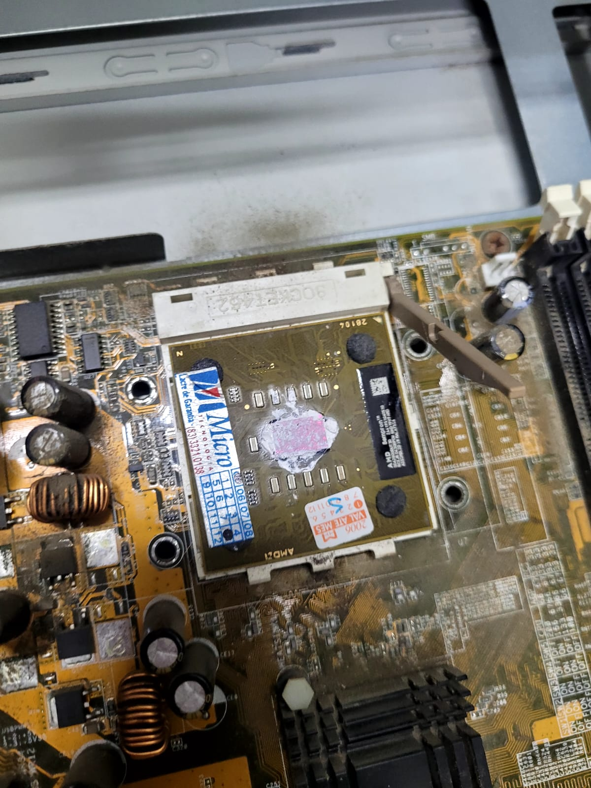

13. Desafixar a placa-mãe do chassi metálico do gabinete.

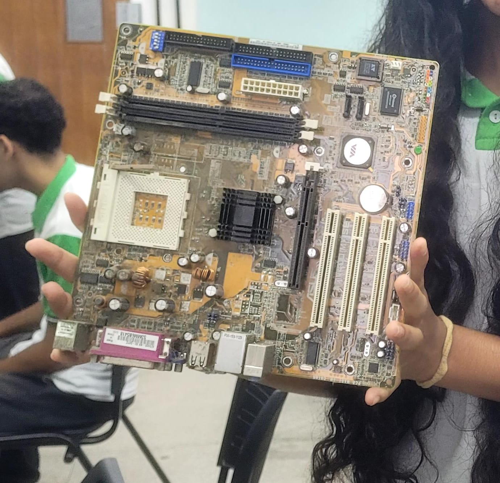

14. Realizar a limpeza.

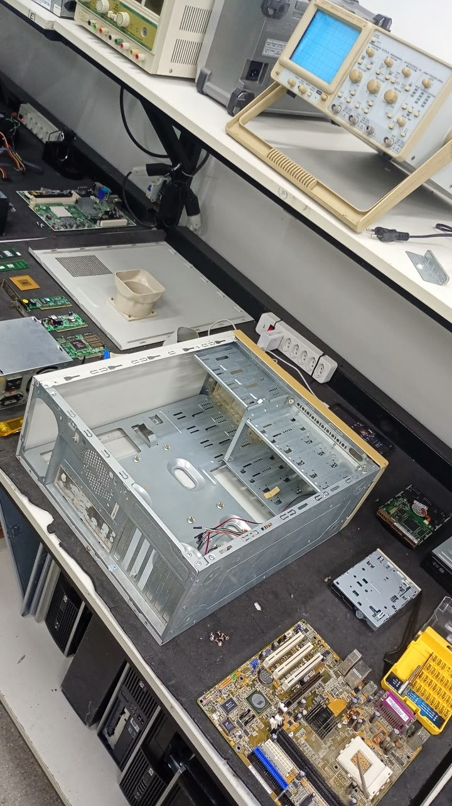

## Montando o PC Desktop

1. Preparar o gabinete. Verifique se o mesmo está em boas condições e possui:
   - Parafusos para fixação da placa-mãe.
   - Parafusos para fixação da fonte de alimentação.
   - Parafusos para fixação de unidades de armazenamento.
   - Parafusos para fixação de placas de expansão.
   - Conectores para os botões de liga/desliga e reset.
   - Conectores para os LEDs de atividade.
   - Conectores para os conectores de áudio e vídeo, se houver.
   - Conectores para os conectores USB.

2. Fixar placa-mãe no chassi metálico do gabinete.

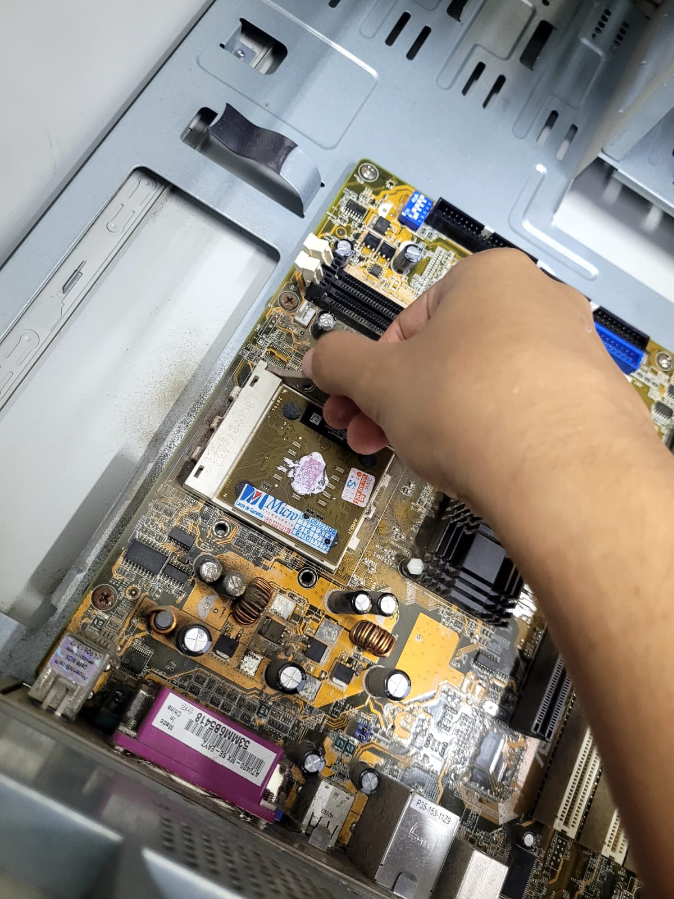

3. Instalar conectores do gabinete à placa-mãe.

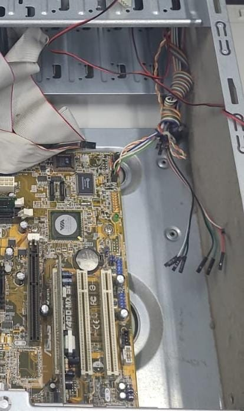

4. Conectar periféricos on-board (conectores dos barramentos externos).

5. Instalar processador na placa-mãe.

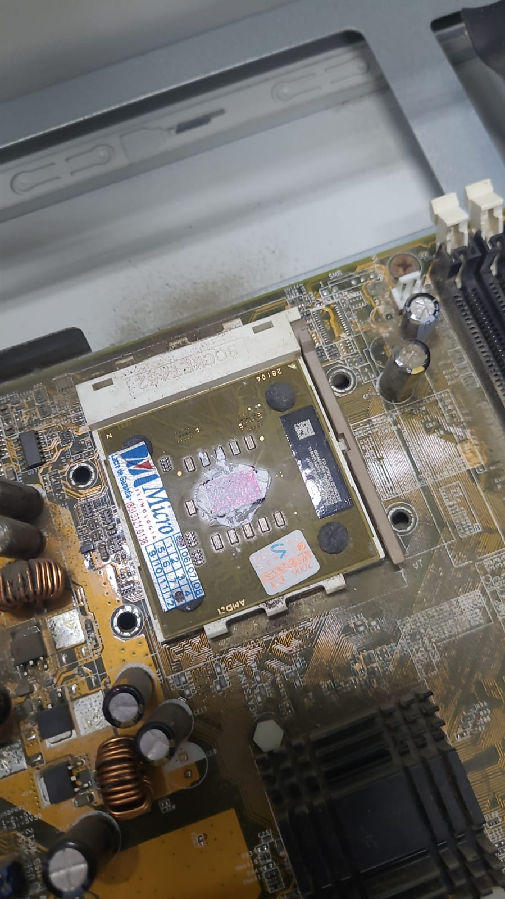

6. Colocar pasta térmica e instalar dissipador e a ventoinha (cooler).

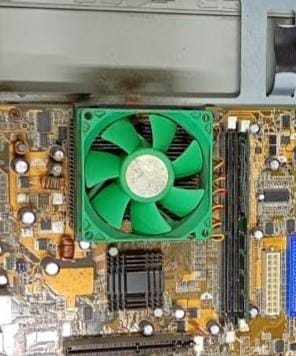

7. Instalar memória RAM na placa-mãe.

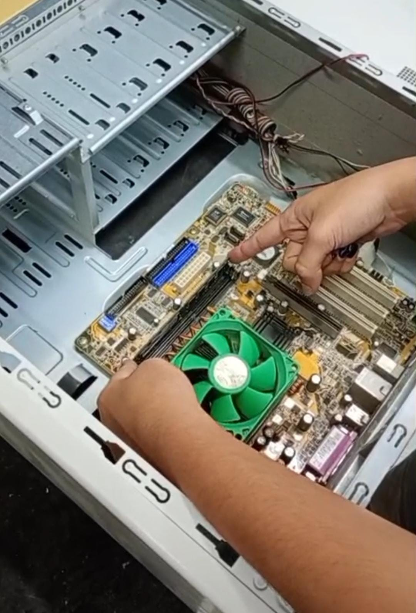

8. Instalar placa de vídeo.

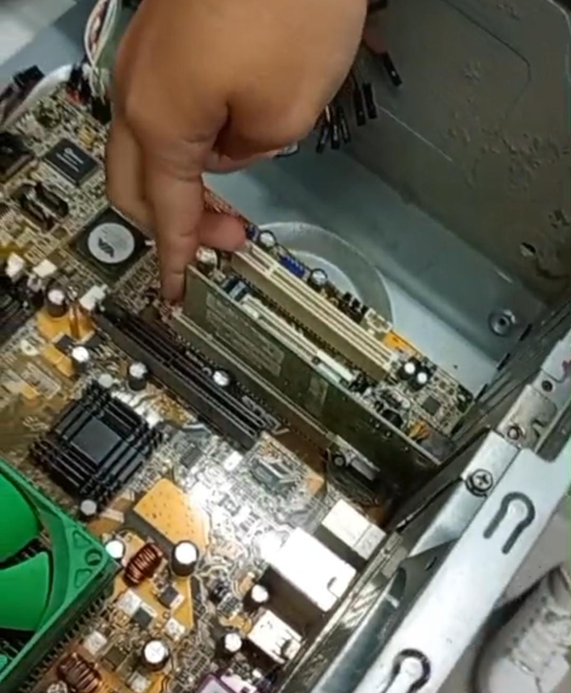

9. Fixação das unidades de armazenamento secundário (SSDs, HDDs, unidades ópticas)

10. Instalar fonte de alimentação

11. Instalar conectores da fonte de alimentação.

12. Instalar cabos flat.

13. Instalar demais periféricos, caso existam.

14. Instalar mouse, teclado e monitor de vídeo.

15. Conferir tudo: tensão da fonte de alimentação, do estabilizador (se houver), tomada com aterramento.

16. Ligar o PC pela primeira vez.

## Procedimentos após a montagem

Após finalizar a montagem do computador:

1. Verificar se todos os componentes estão corretamente instalados.
2. Conferir todas as conexões dos cabos.
3. Conectar os periféricos.
4. Conectar o cabo de alimentação.
5. Ligar o computador.
6. Verificar se o computador inicializa corretamente.

---

## Integrantes

- Nome do integrante 1
- Nome do integrante 2
