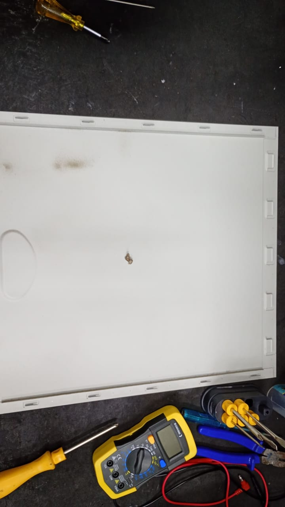
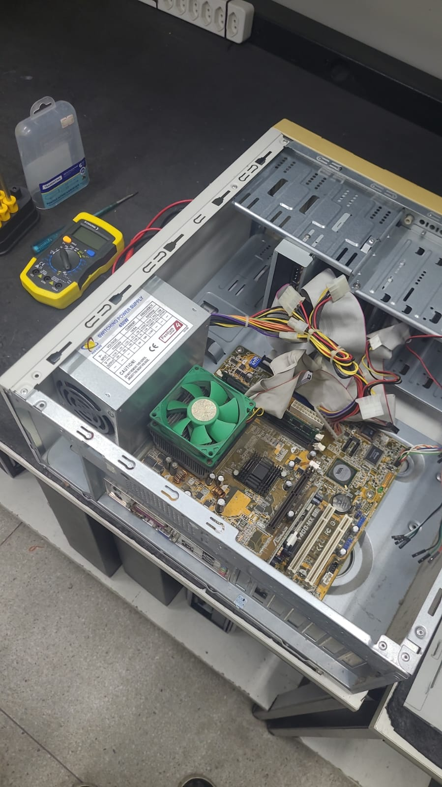

# Montagem e desmontagem de computadores

Tutorial prático sobre o processo de desmontagem e montagem de um computador, realizado durante aulas práticas.

## Ferramentas necessárias

Para realizar a desmontagem e montagem do computador, foram utilizadas as seguintes ferramentas:

- Chave Phillips
- Pincel para limpeza
- Pinça

---

## Desmontando o PC Desktop

Lembre-se de deixar a bancada de manutenção limpa e arrumada!

1. Desligue o computador e desconecte todos os cabos e periféricos, como mouse, teclado, monitor, impressora etc.

2. Remova os parafusos que prendem a tampa do gabinete.

3. Desconectar os conectores da fonte de alimentação.

4. Retirar fonte de alimentação do gabinete.

5. Desinstalar placas de vídeo e de som off-board, se houver.

6. Desinstalar outras placas conectadas à placa-mãe, se houver.

7. Desconectar conectores do gabinete acoplados à placa-mãe (somente gabinetes ATX e ITX).

8. Desconectar cabos de dados.

9. Desafixar unidades de armazenamento secundário (HDDs, SSDs, dispositivos ópticos etc.)

10. Desinstalar memória RAM na placa-mãe.

11. Desinstalar dissipador de calor e ventoinha dos processador.

12. Desinstalar processador na placa-mãe.

13. Desafixar a placa-mãe do chassi metálico do gabinete.

14. Realizar a limpeza.

## Montando o PC Desktop

Após finalizar a desmontagem, inicia-se o processo de montagem dos componentes no gabinete.

### 1. Preparar o gabinete

Verifique se o gabinete está preparado para receber novamente os componentes.

### 2. Instalar a placa-mãe

Posicione a placa-mãe corretamente no gabinete e fixe-a utilizando os parafusos apropriados.

### 3. Instalar o processador

Posicione o processador corretamente no soquete da placa-mãe.

### 4. Instalar o cooler

Instale o cooler sobre o processador e certifique-se de que esteja devidamente fixado.

### 5. Instalar a memória RAM

Encaixe os módulos de memória RAM nos slots correspondentes da placa-mãe.

### 6. Instalar os demais componentes

Instale os demais componentes que foram retirados durante a desmontagem.

### 7. Instalar a fonte de alimentação

Posicione e fixe a fonte de alimentação no gabinete.

### 8. Conectar os cabos

Conecte novamente os cabos de alimentação e os demais cabos necessários para o funcionamento do computador.

### 9. Organizar os cabos

Organize os cabos dentro do gabinete para evitar que fiquem soltos ou atrapalhem os componentes.

### 10. Fechar o gabinete

Após verificar todas as conexões, coloque novamente a tampa do gabinete e fixe os parafusos.

---

## Procedimentos após a montagem

Após finalizar a montagem do computador:

1. Verificar se todos os componentes estão corretamente instalados.
2. Conferir todas as conexões dos cabos.
3. Conectar os periféricos.
4. Conectar o cabo de alimentação.
5. Ligar o computador.
6. Verificar se o computador inicializa corretamente.

---

## Integrantes

- Nome do integrante 1
- Nome do integrante 2
